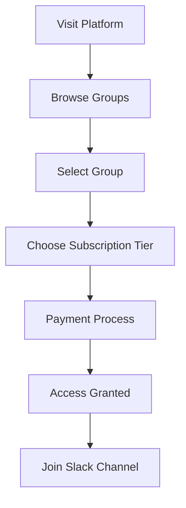
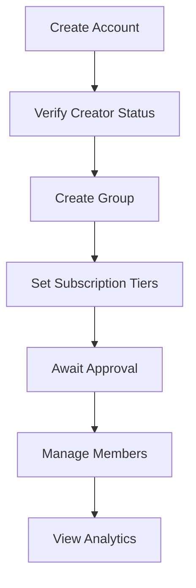
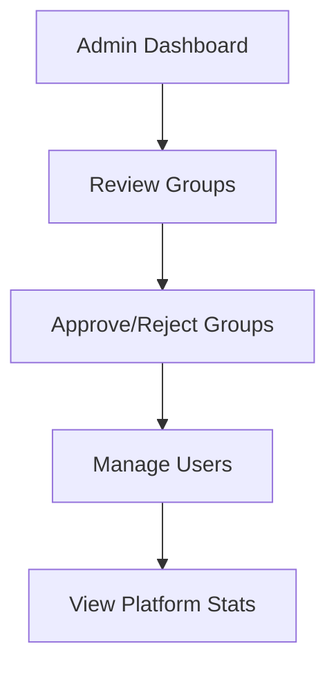
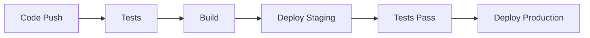

# Groopie Application Architecture

## Overview
Groopie is a platform that enables creators to monetize their Slack communities through subscription-based access. The platform manages member access, payments, and community engagement through an automated system.

## Tech Stack

### Frontend
- **Framework**: Next.js 14.1.0 with App Router
- **Styling**: Tailwind CSS, Shadcn/UI
- **State Management**: Zustand
- **Form Handling**: React Hook Form + Zod
- **API Integration**: Supabase Client

### Backend
- **Runtime**: Node.js
- **Framework**: Express
- **Database**: PostgreSQL (via Supabase)
- **Authentication**: Supabase Auth
- **Email Service**: SendGrid
- **Payment Processing**: Stripe

### Infrastructure
- **Database & Auth**: Supabase
- **Hosting**: Vercel (Frontend), Railway (Backend)
- **Community Platform**: Slack API
- **Version Control**: Git

## User Roles and Flows

### 1. Subscriber Role


#### Subscriber Features
- Browse available groups
- View subscription tiers
- Process payments
- Access Slack channels
- Manage subscriptions
- View payment history

### 2. Creator Role


#### Creator Features
- Create and manage groups
- Set subscription tiers and pricing
- View member analytics
- Access earnings dashboard
- Manage Slack channel settings
- View subscriber list

### 3. Admin Role


#### Admin Features
- Review and approve groups
- Manage user roles
- View platform analytics
- Handle support requests
- Monitor system health

## Core Processes

### 1. Group Creation Process
1. Creator submits group details
2. Admin reviews submission
3. Upon approval:
   - Slack channel is created
   - Group becomes visible
   - Creator can set up tiers

### 2. Subscription Flow
1. User selects a group and tier
2. Processes payment through Stripe
3. Upon successful payment:
   - Subscription record created
   - Slack invitation sent
   - Access granted to channel

### 3. Revenue Distribution
1. Platform collects payment
2. Automated split:
   - 80% to creator
   - 20% platform fee
3. Payouts processed at $500 threshold

## Database Schema

### Core Tables
1. **profiles**
   - User information
   - Role management
   - Profile details

2. **groups**
   - Group details
   - Creator association
   - Slack integration

3. **subscriptions**
   - Member subscriptions
   - Payment status
   - Access control

4. **plans**
   - Subscription tiers
   - Pricing
   - Features

### Relationships
```
profiles --< groups (creator_id)
groups --< plans
plans --< subscriptions
profiles --< subscriptions (subscriber_id)
```

## Security Implementation

### Authentication
- Supabase Auth for user management
- JWT token-based authentication
- Role-based access control (RBAC)

### Data Protection
- Row Level Security (RLS)
- Encrypted sensitive data
- Secure API endpoints

### Payment Security
- Stripe for secure payments
- PCI compliance
- Secure webhook handling

## Integration Points

### 1. Slack Integration
```typescript
interface SlackIntegration {
  createChannel(groupName: string): Promise<string>;
  inviteMember(channelId: string, email: string): Promise<void>;
  setChannelTopic(channelId: string, topic: string): Promise<void>;
}
```

### 2. Payment Integration
```typescript
interface PaymentIntegration {
  createSubscription(userId: string, planId: string): Promise<string>;
  processPayment(amount: number, currency: string): Promise<void>;
  handleRefund(subscriptionId: string): Promise<void>;
}
```

### 3. Email Integration
```typescript
interface EmailIntegration {
  sendWelcome(email: string, groupName: string): Promise<void>;
  sendInvitation(email: string, groupDetails: GroupDetails): Promise<void>;
  sendPaymentConfirmation(email: string, receipt: Receipt): Promise<void>;
}
```

## Monitoring and Analytics

### Key Metrics
1. **Business Metrics**
   - Active subscriptions
   - Revenue per group
   - Conversion rate
   - Churn rate

2. **Technical Metrics**
   - API response times
   - Error rates
   - System uptime
   - Database performance

### Logging
- Request/Response logging
- Error tracking
- Audit trails
- Performance monitoring

## Deployment Strategy

### Environments
1. **Development**
   - Local development
   - Feature testing

2. **Staging**
   - Integration testing
   - Pre-release validation

3. **Production**
   - Live environment
   - Monitoring active

### CI/CD Pipeline


## Error Handling

### Types of Errors
1. **User Errors**
   - Invalid input
   - Authentication failures
   - Permission denied

2. **System Errors**
   - API failures
   - Database errors
   - Integration issues

### Error Response Format
```typescript
interface ErrorResponse {
  status: number;
  message: string;
  code: string;
  details?: any;
}
```

## Future Considerations

### Scalability
- Horizontal scaling
- Caching strategy
- Load balancing

### Features Pipeline
1. Analytics dashboard
2. Advanced reporting
3. Custom integrations
4. Mobile application

### Maintenance
- Regular security audits
- Performance optimization
- Dependency updates
- Feature deprecation 